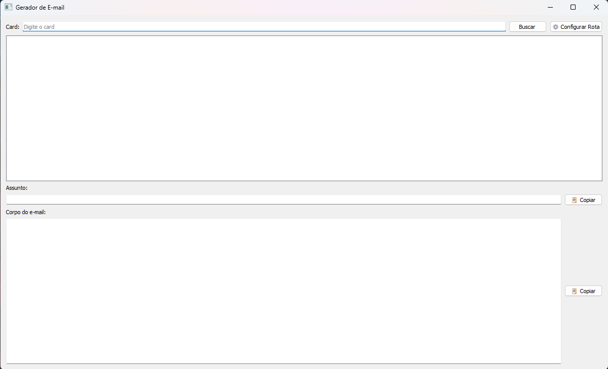
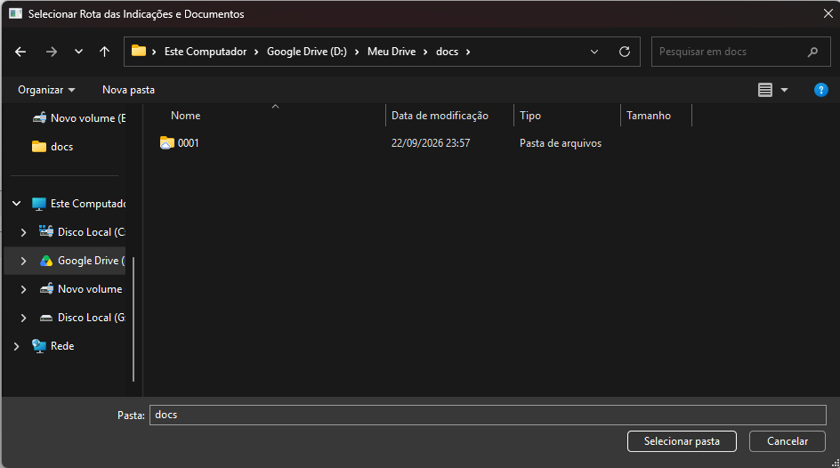
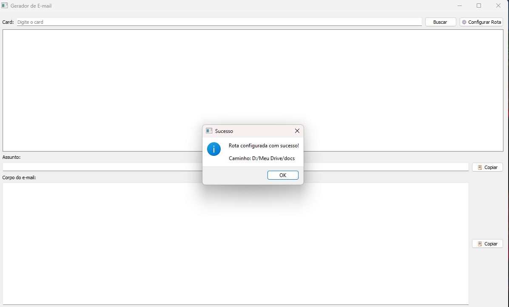
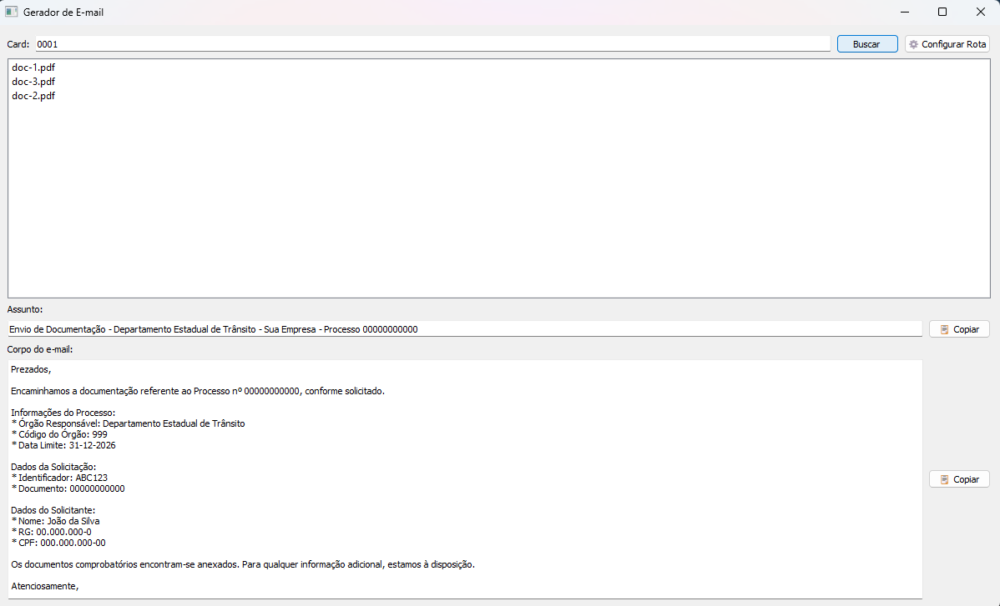

# 📧 Gerador de E-mail

Aplicação desktop desenvolvida em **Python + PyQt5** para facilitar a geração de e-mails e a localização dos documentos relacionados a cada processo.

O projeto surgiu a partir de uma aplicação que já existia e foi aprimorado para deixar o fluxo mais simples: separar assunto e corpo do e-mail, facilitar a cópia das informações e localizar automaticamente os documentos necessários.

> 🔒 Esta é uma versão pública do projeto.  
> Dados internos, credenciais, documentos reais e informações da empresa foram substituídos por dados fictícios.

---

## 💡 Sobre o projeto

Durante o processo de indicação de condutor, algumas etapas eram repetitivas, como consultar as informações do processo, montar o e-mail e procurar os documentos correspondentes.

A aplicação centraliza essas etapas em uma única interface.

Basta informar o número do card para que o sistema:

- consulte os dados do processo;
- gere o assunto do e-mail;
- monte o corpo da mensagem;
- localize os documentos relacionados;
- permita copiar o conteúdo rapidamente.

Para esta versão pública, o card `0001` foi criado especialmente para demonstração e utiliza somente dados fictícios.

---

## 🖥️ Demonstração

### 1. Tela inicial

Ao abrir a aplicação, o usuário pode informar o número do card ou configurar a pasta onde ficam os documentos.



### 2. Configuração da pasta de documentos

Na primeira utilização, basta selecionar a pasta onde os documentos estão armazenados.



A rota escolhida fica configurada para que a aplicação consiga localizar os arquivos automaticamente.



### 3. Busca do processo

Depois de informar o card e clicar em **Buscar**, a aplicação reúne as informações e apresenta os documentos encontrados, o assunto e o corpo do e-mail.



Assim, as principais informações necessárias para o envio ficam reunidas em uma única tela.

---

## ⚙️ Como funciona

O fluxo da aplicação é simples:

**Card → Consulta dos dados → Busca dos documentos → Geração do assunto e do e-mail**

No ambiente real, os dados podem ser consultados através da API do Jira.

Na demonstração pública, o card `0001` utiliza dados locais fictícios e não realiza chamadas ao Jira.

---

## 🛠️ Tecnologias utilizadas

- **Python**
- **PyQt5** — interface gráfica
- **Requests** — comunicação com a API REST do Jira
- **python-dotenv** — gerenciamento das variáveis de ambiente
- **PyInstaller** — geração do executável

---

## 📂 Estrutura do projeto

```text
gerador-emails/
│
├── main.py
├── main.spec
├── requirements.txt
├── .env.example
│
├── core/
│   ├── config.py
│   ├── config_drive.py
│   └── dados_demo.py
│
├── services/
│   ├── jira_email_services.py
│   ├── jira_service.py
│   ├── email_service.py
│   └── drive_service.py
│
├── interface/
│   └── janela_pyqt.py
│
├── demo/
│   └── documentos/
│       └── 0001/
│
└── docs/
    └── images/
        ├── tela-inicial.png
        ├── configurar-rota.png
        ├── rota-configurada.png
        └── resultado-busca.png
```

---

## 🚀 Como executar

Clone o repositório:

```bash
git clone <url-do-repositorio>
cd gerador-emails
```

Crie o ambiente virtual:

```bash
python -m venv venv
```

No Windows:

```bash
venv\Scripts\activate
```

Instale as dependências:

```bash
pip install -r requirements.txt
```

Execute:

```bash
python main.py
```

---

## 🧪 Testando a versão de demonstração

Para testar sem precisar de acesso ao Jira:

1. Execute `python main.py`;
2. Clique em **⚙️ Configurar Rota**;
3. Selecione a pasta `demo/documentos`;
4. Digite `0001` no campo **Card**;
5. Clique em **Buscar**.

O card `0001` utiliza dados fictícios preparados exclusivamente para demonstração.

---

## 🔗 Integração com Jira

Para utilizar a integração com um ambiente próprio do Jira, copie o arquivo `.env.example` para `.env` e configure suas credenciais:

```env
JIRA_EMAIL=seu-email@suaempresa.com
JIRA_TOKEN=seu-token
JIRA_DOMAIN=https://suaempresa.atlassian.net
JIRA_PROJECT_KEY=PROJ
NOME_EMPRESA=Sua Empresa
```

O arquivo `.env` não deve ser enviado para o GitHub e já está incluído no `.gitignore`.

---

## 🔐 Segurança

Esta versão foi preparada para publicação e não contém:

- credenciais de acesso;
- tokens de API;
- documentos reais;
- dados pessoais de terceiros;
- informações internas da empresa.

Os dados disponíveis no modo de demonstração são fictícios.

---

## 📌 Melhorias realizadas

Entre as melhorias feitas no projeto estão:

- separação do assunto e do corpo do e-mail;
- botões individuais para copiar as informações;
- configuração da pasta de documentos pela própria interface;
- localização automática dos arquivos relacionados ao processo;
- criação de um modo de demonstração para a versão pública;
- organização do projeto para publicação no GitHub.

---

## 👩‍💻 Autora

**Gabriela Perez de Souza**

Projeto desenvolvido como parte dos meus estudos e da minha experiência com **Python, automação de processos e desenvolvimento de aplicações desktop**.